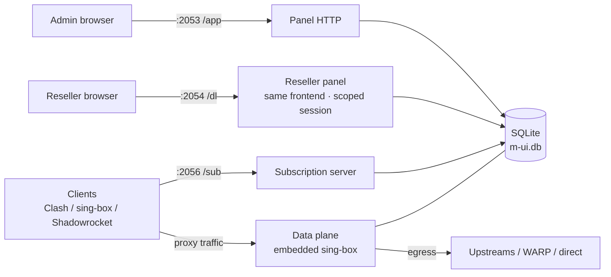
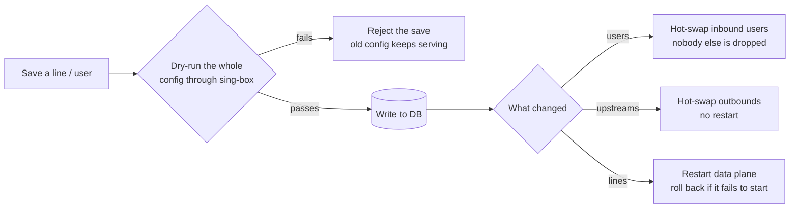
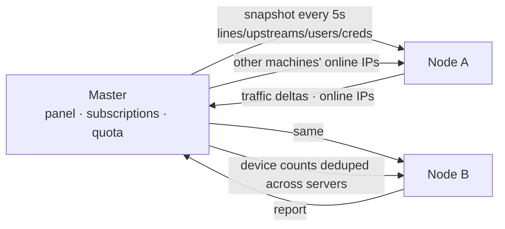
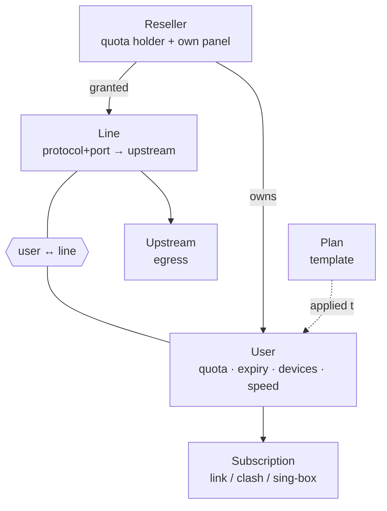

<p align="center"></p>
<h1 align="center">m-ui</h1>
<p align="center">Multi-server proxy panel with embedded <a href="https://github.com/SagerNet/sing-box">sing-box</a> · single binary · one master, any number of nodes · all day-to-day ops inside the panel</p>
<p align="center"><a href="README.md">中文</a> · <b>English</b></p>

---

## What it is

m-ui is a self-hosted proxy panel: one binary, one database file, sing-box embedded. Lines, users, subscriptions, certificates, backups, multiple servers and routine maintenance are all managed from the web UI.

What makes it different from the usual panels:

- **Line model**: a *line* is "inbound protocol + port → upstream". No separate inbound / outbound / routing tables to keep in sync.
- **Config changes don't drop users**: every save is dry-run through sing-box first, so a broken config never reaches the database. User and upstream changes are hot-swapped; only line changes restart the data plane If a config passes validation but still fails to start — say another process grabbed the port in the meantime — m-ui rolls back to the last working one instead of leaving everyone offline.
- **One master, many nodes**: the master pushes lines / upstreams / users to any number of node servers, collects their traffic and enforces quotas centrally. Subscriptions list every line once per server and clients pick the lowest-latency entry automatically.
- **Ops built in**: Let's Encrypt, Cloudflare WARP, kernel tuning, backup / restore, a migration wizard, Telegram alerts, two-factor login and an external API.

Good for personal use, small teams, or anyone who needs one place to manage users across several servers.

## Features

| Area | What you get |
|---|---|
| Lines | Hysteria2, AnyTLS, TUIC, Trojan, VLESS (Reality / Vision), VMess, Shadowsocks (incl. 2022), SOCKS, HTTP, Mixed; WS / gRPC / HTTPUpgrade / HTTP transports; Hysteria2 port hopping; per-server deployment |
| Upstreams | VLESS / VMess / Trojan / TUIC / Hysteria2 / Shadowsocks / SOCKS exits, import by pasting a share link; latency test, periodic health checks, failure / recovery alerts; one-click WARP |
| Users | Quota, expiry, periodic reset, concurrent device limit (by source IP, merged across servers), up / down speed limits; auto-disable and kick on overuse or expiry; bulk create, bulk actions, CSV export. Reseller-owned users stay in the reseller's panel and out of the main user list |
| Plans | Templates for quota / duration / devices / speed / lines; apply on create, renew or extend |
| Resellers | Give a reseller lines plus traffic / device / bandwidth budgets and an expiry; they create users and plans in their own panel (port 2054, path /dl). Usage rolls up to the reseller, and going over quota, expiring or being disabled cuts off all of their users at once |
| Subscriptions | Universal link, Clash and sing-box formats; landing page in the browser (usage, expiry, one-tap import, QR); users can hand out a temporary share link themselves; external nodes / external subscriptions merged in; `insecure` added automatically for self-signed certs |
| Multi-server | Master pushes config, collects traffic, enforces quotas; per-server traffic ratio; node offline / recovery alerts |
| Certificates | Let's Encrypt via HTTP-01 or Cloudflare DNS-01, auto-renewal, hot reload without restart; one-click self-signed cert when you have no domain |
| Backup | One zip with a consistent database snapshot and certificates; upload to restore a whole server; scheduled backups, rotation, push to Telegram; migration wizard |
| Ops | WARP install / enable / disable / uninstall with exit-IP verification; swap, sysctl + BBR, file limits, NTP |
| Alerts | Telegram: logins, user expiring / over quota / disabled, upstream failures, data plane down, daily report (its hour and dates follow the panel time zone) |
| Observability | Traffic charts (stacked bars, 1h / 6h / 24h / 7d / 30d), top users, online users and IPs, recent inbound connections for troubleshooting, audit log, subscription access log |
| Security | bcrypt passwords, CSRF protection, login cooldown after repeated failures from the same peer, two-factor authentication (TOTP), external API tokens; reseller and admin sessions are strictly separated |
| Updates | The panel finds new releases by itself and flags them next to the version in the sidebar; one click verifies the SHA256, swaps the binary and restarts — database, certificates and settings are untouched |
| Integration | External API for creating users, applying plans, enabling / disabling, renewing and fetching subscription URLs, see [docs/API.md](docs/API.md) |

## Architecture

One process runs three things: the **panel** (for you), the **subscription server** (for clients), and the **data plane** (embedded sing-box, where traffic actually flows). They share one SQLite file, so a change takes effect immediately.



**What happens when you save** — the panel never edits a running sing-box in place:



**Multi-server** is one master, any number of nodes. The master does the accounting and pushes config; nodes just forward.



**The data model** is four main tables:



| Component | Responsibility | Code |
|---|---|---|
| Panel | Admin UI and API, reseller panel, external API | `web/` |
| Render | Lines → sing-box config, dry-run before save | `render/` `core/validate.go` |
| Data plane | Embedded sing-box, traffic stats, connection tracking, limits | `core/` |
| Subscriptions | Three formats, landing page, temporary sharing | `sub/` |
| Sync | Snapshot push, traffic collection, online aggregation | `hub/` |
| Orchestration | Process lifecycle, certificates, backups, external nodes | `runner/` |
| Scheduled | Stats, quota enforcement, cleanup | `jobs/` `monitor/` |

## Installation

### Requirements

- Linux amd64 or arm64 with systemd (Debian 11+ / Ubuntu 20.04+ recommended)
- root
- Open ports: panel `2053/tcp`, subscription `2056/tcp`, `2054/tcp` as well when the reseller panel is on, plus the ports of the lines you create (TCP or UDP depending on protocol). HTTP-01 certificate issuance also needs `80/tcp` reachable

### One-line install (recommended)

```bash
bash <(curl -fsSL https://raw.githubusercontent.com/Maoyangui/m-ui/main/deploy/install.sh)
```

Not root? Use the piped form:

```bash
curl -fsSL https://raw.githubusercontent.com/Maoyangui/m-ui/main/deploy/install.sh | sudo bash
```

The script detects the architecture, downloads the latest release from GitHub, installs `/usr/local/bin/m-ui`, keeps data in `/etc/m-ui/` and registers `m-ui.service`. It prints the panel URL and default credentials when done.

Specific version or offline:

```bash
bash install.sh v0.2.0                              # pin a version
bash install.sh ./m-ui-linux-amd64.tar.gz           # local file (release tarball or bare binary)
bash install.sh https://.../m-ui-linux-arm64.tar.gz # any download URL
```

### First login

- Panel: `http://<server-ip>:2053/app/`
- Default account: `admin` / `admin`

A banner keeps reminding you until the default password is changed; do it on the **Admin** page right away. Port, path and credentials can also be changed from the SSH menu (`m-ui`).

The panel UI is available in Chinese and English (switch at the bottom of the sidebar). The SSH menu and install script are currently Chinese only.

### Upgrade

```bash
m-ui            # menu item 10 "update to latest"
```

or run the one-line installer again. Upgrades replace the binary and restart; database, certificates and backups are untouched.

### Uninstall

`m-ui` menu item 14, optionally removing the `/etc/m-ui` data directory.

## Quick start

The dashboard shows a **Quick start** checklist. In order:

1. **Domain** (optional): Settings → Panel → Domain. Point an A record at the server.
2. **Certificate**: on the Certificate page enter the domain and issue a Let's Encrypt cert; without a domain click "self-signed" with the server IP. Panel, subscription and data plane share the cert and it renews itself.
3. **Line**: Lines → Add, pick a protocol (Hysteria2 or AnyTLS recommended), a port and an upstream (direct by default).
4. **User**: Users → Add, tick the lines the user may use, or apply a plan.
5. **Hand out the subscription**: copy the subscription link from the user list, or let the user open the landing page in a browser to scan / import.

No domain is fine: self-signed cert + IP, and every node in the subscription already carries "allow insecure" (`insecure=1` in links, `skip-cert-verify` in Clash, `insecure` in sing-box), so clients need no extra setting. Issue a real certificate later and users only need to refresh once.

## Feature guide

### Lines

- One line = one entry port. Ports are identical on every server; the master renders and pushes the config to each node.
- The **upstream** decides where traffic exits: direct, WARP, or any relay you added.
- **Deploy to**: all servers by default, or only selected ones, e.g. a line that exists only on one node.
- Hysteria2 accepts a **port-hopping range** (e.g. `20000-30000`): the server forwards that UDP range to the line port with nftables / iptables and clients hop between ports, which sidesteps per-port UDP throttling by ISPs.
- Every save dry-runs the full sing-box config; a failing change is rejected instead of stored.

> New lines get a free five-digit port filled in automatically (still editable): it avoids ports already used by other lines and by the panel / subscription / reseller panel, and the server binds it once to confirm it is free. Ports you type are checked the same way — **including ports held by other software on the same box**: the save is rejected if nginx, another panel or anything else already holds it (an edit that does not change the port skips the check, since the running data plane is what holds it). Conflicts are blocked in both directions: a line cannot take a panel port, and the panel / subscription / reseller ports cannot move onto a port a line or another process is using. You get the error on save instead of a service that fails to start after the next restart.

### Upstreams

- Edit visually or paste `vless://`, `hy2://`, `ss://` … share links.
- Latency test through the upstream, periodic checks; Telegram alert on repeated failure and again on recovery.
- Enabling WARP on the Ops page creates an upstream named `warp`; pick it on a line to exit through WARP.

### External nodes

Merge nodes from elsewhere into your subscriptions: a single share link, or a whole external subscription (provider / relay). The master fetches it on a schedule; once assigned to a user, those nodes appear after this site's nodes, optionally with a prefix.

### Users and plans

- Per user: quota, expiry, periodic reset (e.g. every 30 days), device limit, speed limit, remark, allowed lines and external nodes.
- Over quota or expired → disabled and kicked automatically; resetting traffic re-enables.
- Plans are templates: apply on create; *renew* applies again (usage reset, expiry extended); *extend* keeps usage and only extends expiry.
- Bulk: generate by prefix, select rows for enable / disable / extend / reset / delete, CSV export.
- User drawer: live devices (each IP shows the line and server it is using), 24h / 7d / 30d chart, subscription links and QR, kick.

### Resellers

Hand part of the selling to someone else: create a reseller on the Resellers page, tick the lines they may use, give them a traffic quota and a device budget.

- Reseller panel: `https://<domain or IP>:2054/dl/` by default. Port, path and certificate live under Settings → Reseller panel (an empty certificate means it shares the main panel's).
- The login name is the reseller's name and **a new reseller has no password**: they log in with the name and an **empty password**, then must set one before anything else, then can change it and enable two-factor auth. "Reset password" on the main panel clears it again.
- Inside their panel a reseller only sees their own users. Creating one takes just a name — the subscription URL is a long random token, and link / Clash / sing-box formats plus the QR code all work as usual. They can assign lines (only the ones granted to them), quota, expiry, devices and speed limits, and renew, reset, kick, batch-edit or inspect traffic and online devices. **Plans are per-reseller too**: they only see and use the ones they created.
- Quota: traffic counts **all-time**, so a reseller cannot wash it away by resetting, renewing or deleting users — only the main panel's "Reset traffic" clears it. Devices and up/down bandwidth are allocation budgets: what they hand out cannot add up to more than the total. Expiry, being disabled or going over quota each pull their users from the data plane at once and make their subscriptions return 404.
- A reseller can set their own **profile title** (the name clients show) plus landing-page title, notice and support contact — empty inherits the main panel's — and can switch off their own landing page or temporary sharing.
- A new reseller has a 24-hour claim window: sign in once with the name and an empty password and set a password. After that the main panel has to reset the password again to reopen the window, so an unclaimed account cannot sit open forever.
- Reseller users never appear in the main user list or CSV export. The reseller drawer lists them one per row — usage, expiry, online devices — expandable to show which line on which server each IP is using, with their subscription URL one click away.
- The reseller detail drawer on the main panel lists each of their users with the subscription URL, usage, expiry, online IPs and the lines those IPs are on.

### Subscriptions

- Universal: `https://<domain-or-ip>:2056/sub/<user>` for nextin, sing-box, Shadowrocket, Surge, Quantumult X, Loon, Karing and others.
- Settings → Subscription → "Use the username as the subscription URL" is on by default. Turn it off and **new** users get an unguessable random token instead (the username stays a plain label); existing users keep their URL, and reseller-created users always get a token.
- Clash: append `?format=clash` for mihomo / Clash Verge / Stash; each line becomes a latency-selected group of entries.
- sing-box: append `?format=json` for a complete sing-box client config (TUN, groups, DNS, basic routing) that SFA (Android), SFI (iOS) and the desktop build import as a remote profile; the landing page has a one-tap import button.
- The name clients show comes from Settings → Subscription → "Profile title" (falling back to the landing-page title, then the remark, then the username). It goes out on both `Content-Disposition` and `Profile-Title`, encoded the standard way for non-ASCII. Clients that re-read the title on every update (nextin, sing-box) pick it up on refresh; Shadowrocket and Clash Verge name a profile **when it is added** and never rename it — add it through the landing page's one-tap import (which carries the title) or re-add it.
- Opening the link in a browser shows a landing page: usage, expiry, one-tap import for each client, QR codes, custom notice and support contact.
- Temporary sharing: from the landing page a user can create one random link to lend their subscription, one per user. The link carries the same nodes but a **separate set of credentials** registered under the owner's name, so traffic, devices, speed limits and expiry all count against the owner. Cancelling (or regenerating) pulls those credentials immediately and drops the connections, so nodes already imported by the borrower stop working too. Shared links serve the subscription only, never the landing page. Settings → Subscription page turns the whole thing off.
- Node addresses default to the **server IP** with the domain only as SNI, so a poisoned local DNS on the client cannot break connectivity; switch to domain in Settings if you prefer.
- With several servers each line appears once per server, suffixed with the server name; servers with a traffic ratio other than 1 get a tag such as `x2`.

### Multi-server

Any number of nodes. To attach one:

1. Install m-ui on the node, sign in, Settings → Role → "run as node".
2. Copy the API URL and token from Settings → Pairing on the node.
3. On the master, Servers → Add: name (e.g. "HK", used as the node-name suffix), domain, API URL, token; optionally skip certificate verification if the node uses a self-signed cert.
4. Within seconds the master pushes and shows "synced".

How it works: the master compares a snapshot every few seconds and pushes on change; in the same round it pulls the node's traffic ledger, online IPs, status and certificate expiry. Quotas are enforced only on the master; a disabled user reaches every node within about 5 seconds. A node unreachable for over a minute triggers one alert and one more on recovery; while offline it keeps serving users with its last config.

Each server, including the master, can have a **traffic ratio**: traffic through it counts toward users' usage multiplied by the ratio, e.g. 2× for an expensive route.

> Deleting a server strips it from every line's "deploy to servers" list. A line that was deployed only on that server has nowhere left to run, so it is disabled as well (rather than silently spreading to every server); the response lists which lines were disabled.

### Certificates

Three sources:
- **With a domain**: Let's Encrypt via HTTP-01 (port 80 reachable) or Cloudflare DNS-01 (API token, no port 80). DNS and port are pre-checked; auto-renewal reloads everything without a restart.
- **Without a domain**: self-signed certificate for the server IP. Used for line inbounds only by default; subscriptions automatically carry "allow insecure" so clients connect, while panel and subscription stay on HTTP (browsers and clients reject self-signed HTTPS).
- **Existing certificate**: point at a certificate and key already on the server (certbot, nginx, commercial…). Only paths are stored; they are checked for a matching, unexpired pair. Renew by overwriting the files.

Line inbounds always use the current certificate; **panel HTTPS and subscription HTTPS are separate checkboxes** (subscription applies immediately, panel needs an m-ui restart). Nodes keep their own certificates.

### Backup and migration

- Backup page: download a zip (consistent DB snapshot + certs); scheduled backups with rotation, optionally pushed to Telegram.
- Restore: upload the zip on the new server's Backup page and m-ui restarts fully restored, or `bash install.sh --restore backup.zip` at install time.
- Migration wizard: install and restore on the new server → check the panel → point DNS at the new IP (the page checks major resolvers) → retire the old server. Ports, credentials and subscription URLs stay the same, users notice nothing.

### Ops

- WARP: install / enable (local SOCKS5, MASQUE) / disable / uninstall, with exit-IP verification.
- System tuning: swap, sysctl + BBR, file-descriptor limits, NTP; parameters adjustable per machine. Tasks run one at a time with live output.

### Logs

Subscription access log, core log (data plane + panel) and audit log. Logging can be switched off on the core log tab to save resources, and every log can be cleared with one click.

### Admin

- Change username / password.
- **Two-factor authentication**: generate a secret and scan it, or paste an existing secret; enter one code to enable. Works with Google / Microsoft Authenticator, Authy, 1Password and more. Lost your phone? Run `m-ui` over SSH and pick "disable 2FA"; resetting the password also clears it.
- **External API**: flip the switch to get a token, then a shop / billing system / bot can create users, apply plans, enable / disable, kick and fetch subscription URLs. The page lists the endpoints with curl examples; full reference in [docs/API.md](docs/API.md).

### Settings

**Time zone** (default Asia/Shanghai; every time in the panel uses it), listen address · port · path · certificate for the panel, the subscription server and the reseller panel, subscription display options, landing-page text, Telegram notification toggles, upstream check parameters, data-plane stats granularity. Panel and subscription path changes apply immediately; port, listen address and certificate path changes need a restart (button in the page header). The reseller panel can be switched off entirely (`resellerEnabled`) and never starts on nodes.

## Command line

```
m-ui                                         numeric menu (below)
m-ui run -db /etc/m-ui/m-ui.db               start (used by systemd)
m-ui info -db <db>                           print panel URL, path and account status
m-ui set -db <db> key=value ...              change settings, e.g. webPort=3053 nodeMode=true
m-ui passwd -db <db> [-password NEW]         reset the admin password (also disables 2FA)
m-ui backup -db <db> -out backup.zip         create a backup
m-ui restore -db <db> -from backup.zip       restore (service stopped)
m-ui import -from old-panel.db -to <db>      import an old panel database
m-ui selfsign -hosts domain,ip               generate a self-signed certificate
m-ui render -db <db>                         print and validate the sing-box config
m-ui version
```

Run `m-ui` without arguments for the menu (Chinese):

```
 1. panel URL / account            8. recent logs
 2. restart                        9. backup now
 3. stop                          10. update to latest
 4. start                         11. self-signed certificate
 5. reset admin password          12. switch master / node role
 6. change panel port / path      13. disable two-factor auth
 7. reset all settings            14. uninstall
```

## Migrating from an old panel

Full migration (lines, upstreams, users and settings):

```bash
bash install.sh --import /path/to/old-panel.db
```

Inbound ports, user credentials, panel path and subscription URLs are preserved, so clients need no changes; the import report lists what was checked.

Users only (lines already rebuilt on m-ui, you just want the old users' names, usage, quota and expiry): Users page → **Import from old panel**, or

```bash
m-ui import -from /path/to/old-panel.db -to /etc/m-ui/m-ui.db -users-only && systemctl restart m-ui
```

Existing names only get usage / quota / expiry / enabled updated; new users are created with their old credentials and, by default, every existing line.

## FAQ

**Clients can't connect but the subscription refreshes fine.** Usually the client's local DNS resolves the domain wrongly. m-ui writes the server IP into subscriptions by default (domain only as SNI); ask users to refresh once. "Recent inbound connections" on the dashboard shows whether the user's IP reaches the server at all.

**Can I run without a domain?** Yes. Generate a self-signed cert with the IP; subscriptions carry "allow insecure". Issue a real cert later and users just refresh.

**Changed the port / listen address and nothing happened?** Those need a restart (button in the Settings header, or menu item 2). Certificate renewal does not. Ports are validated on save (1-65535, and the three services cannot share one), so a typo fails immediately instead of leaving the panel unable to start after the next restart.

**How should paths be written?** `app`, `/app`, `app/`, `//app//` and values with stray spaces all normalize to `/app/`; use `/` to serve the panel at the root. A URL missing the trailing slash (`:2053/app`) redirects to the canonical one, and the subscription path behaves the same way.

**WARP fails to enable?** The task output on the Ops page shows why; usually port 40000 is taken. WARP is only a local SOCKS5 upstream; pick upstream `warp` on a line to use it.

**A node shows offline.** The Servers page shows the reason (bad token / timeout / certificate error). Tick "skip certificate verification" on the master when the node uses a self-signed cert.

**Forgot the password or lost the 2FA phone.** Run `m-ui` over SSH: item 5 resets the password (and clears 2FA), item 13 only disables 2FA.

**Wrong subscription name in the client?** Set "Profile title" under Settings → Subscription (a reseller sets theirs on their own subscription-page card). Shadowrocket and Clash Verge name a profile when it is added and never rename it on refresh — re-add it, or use the one-tap import buttons on the landing page, which pass the title along.

**A reseller cannot sign in?** New resellers have a 24-hour claim window: sign in with the reseller name and an empty password, then set a password. Once it expires — or if they forget the password — Resellers → More → Reset password clears it and reopens the window (two-factor is cleared too).

**Where is the data?** `/etc/m-ui/m-ui.db` (database), `/etc/m-ui/cert/` (certificates), `/etc/m-ui/backups/` (scheduled backups). Backup zips contain user credentials and private keys, keep them safe; on restore, certificates are only written back to paths inside the data directory.

## Development

Go 1.27+ (see go.mod). Reality needs the `with_utls` build tag, so every build and test must carry it:

```bash
make build          # host binary
make linux          # CGO_ENABLED=0 GOOS=linux static binary
make test           # go test -tags with_utls ./...
```

The frontend is zero-build ES modules in `web/assets/`; edit and refresh. Embedded assets get a content-hash ETag so browsers pick up new files after an upgrade. Architecture notes: [docs/ARCHITECTURE.md](docs/ARCHITECTURE.md) (Chinese).

```
core/      embedded sing-box lifecycle, traffic stats, connection tracking, limiter
render/    line → sing-box config rendering and validation
sub/       subscription generation (link / clash), landing page, subscription server
hub/       multi-server sync (snapshot push, traffic collection, online aggregation)
jobs/      stats, quota enforcement, cleanup jobs
monitor/   upstream checks, watchdog, user warnings, daily report
acme/      Let's Encrypt (HTTP-01 / Cloudflare DNS-01)
backup/    backup and restore
ops/       WARP and system tuning scripts
hop/       Hysteria2 port hopping (nftables / iptables)
ext/       external nodes / subscriptions fetching and parsing
upstream/  share-link parsing (shared by upstream import and the sing-box subscription)
creds/     per-protocol credential generation
totp/      two-factor authentication (RFC 6238)
notify/    Telegram notifications
logger/    log buffer behind the panel's log page
tz/        panel time zone
web/       panel and reseller-panel HTTP APIs, external API, frontend
importer/  old panel database import
brand/     logo and contact details
```

Releases: pushing a `v*` tag makes GitHub Actions run the tests, build amd64 / arm64 and publish a release.

## Feedback and support

The "Feedback / Support" button in the panel's top-right corner has the author's Telegram and a donation address; issues and pull requests are welcome too.

## License

GPL-3.0. Embeds [sing-box](https://github.com/SagerNet/sing-box); third-party notices in [NOTICE](NOTICE).
